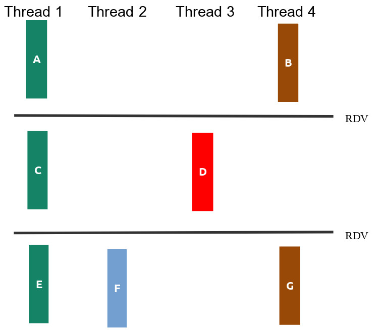

<!-- markdown_py README.md > README.html -->
<!-- pandoc README.md -f markdown -t html -s -o README.html --metadata title="AF SisHard 24-1" -->

# Prova Final - Sistemas Hardware-Software

Neste prova iremos avaliar os objetivos de aprendizagem trabalhados na segunda metade do curso. Cada pasta contém os arquivos de uma questão da prova, incluindo arquivos `.c` para vocês colocarem suas soluções.

## Regras da prova
1. A prova é individual. São permitidas consultas a todos os materiais de aula, incluindo suas soluções a exercícios de aula e labs. **Ficam proibidas consultas a materiais de outros alunos ou pesquisas na Internet**.
1. Não é permitido consultar outras pessoas, sejam do Insper ou não, durante a prova.Não abra E-mail, Whatsapp, Discord, etc.
1. Esta prova também avalia fluência nos conceitos estudados.
1. A prova terá duração de **três horas**, com início às **13:30** e término às **16:30**. 
1. A avaliação da sua prova deverá ser feita pelos testes no github. Além disso, é obrigatório enviar o zip da prova no Blackboard.
1. O item de entrega permite múltiplas tentativas. Sempre que terminar uma questão faça uma entrega completa. Isto visa minimizar problemas com entregas atrasadas.
1. Sua entrega consiste na pasta da prova inteira. **Rezipe e entregue via Blackboard**.
1. A chamada na prova será pela inicialização do proctorio e assinatura. Não saia sem assinar a lista.
1. Cada questão possui um arquivo específico para resposta. Não altere o nome destes arquivos.
1. Não serão tiradas dúvidas do conteúdo da disciplina durante a prova.
1. Fica proibido o uso de ferramentas de geração de código como o copilot. Sujeito a código de ética.

## Antes de começar a resolver

Cole os arquivos desta prova em seu repositório de entregas da disciplina, tendo estes caminhos a partir da raiz:

- `provas/af/q1`
- `provas/af/q2`
- `provas/af/q3`
- `provas/af/q4`

Vamos utilizar o servidor para receber a nota em cada questão. Será necessário soltar releases! A correção será sequencial, ao primeiro problema, irá parar (ou seja, precisa resolver os problemas anteriores para que os próximos critérios sejam considerados).

As issues já terão a sua nota no exercício. Como de costume, um **pass** significa que o servidor não encontrou problemas em sua solução (não que ela esteja correta!). Teremos uma fase de validação extra pelos professores, envolvendo, por exemplo:

- O uso de funções não permitidas poderá resultar na anulação da nota no exercício.
- Os testes pegam apenas alguns casos, garanta que sua solução funciona conforme o requisitado no enunciado.
- Tentativas de burlar os testes resultarão em zero na prova.
- Se passou mas está errado, a nota será desconsiderada.

---

## Questão 1 (2,5)
<style scoped>section { font-size: 20px; }</style>

A figura *q1/sincronizacao.png* ilustra as relações de dependência entre as partes das funções `thread1, thread2, thread3` e `thread4`, mostrando que algumas delas poderiam ser feitas de maneira concorrente.




Seu trabalho nesta questão será:

1. criar threads para execução concorrente das funções. (**40% da nota**).
2. usar semáforos para que a ordem dos prints das partes das tarefas respeitem o diagrama da figura. (**60% da nota**).

**OBS**:

- Você não deve introduzir novas dependências. Ou seja, se seu programa criar relações de dependência além das da figura seu trabalho valerá no máximo 50%.

- Não altere os `printf` existentes, nem adicione novos.

**Como descrubro minha nota?**:

Será pelo corretor automático. Suba as alterações para o git e solte uma release:

```
git tag -a afq1.x.y -m "enviando a afq1.x.y"
git push origin afq1.x.y
```

---

## Questão 2 (2,5)

O executavel **`cURLInsper`** é uma ferramenta de linha de comando para transferir dados de um servidor, usando o protocolo http, a ferramenta funciona como interface para a biblioteca que faz o serviço pesado, o libcurl.

Para fazer o download de uma URL podemos executar no terminal, por exemplo, o comando:

```
./cURLInsper https://www.ufpe.br/index.html 0 
```

No exemplo, estamos tentando fazer o download da página `https://www.ufpe.br/index.html/` onde o valor `0` representa quantas vezes você já tentou fazer o download dessa URL. Assim caso falhe o download, então temos que chamar novamente o executável usando `./cURLInsper https://www.ufpe.br/index.html 1`. Se falhar mais uma vez, o uso deve ser `/cURLInsper https://www.ufpe.br/index.html 2` e assim sucessivamente até que ele obtenha sucesso no donwload. 

Apesar de ter sido contrato um novo programador, o programa agora parece que tem falhado além do habitual, além disso as vezes as chamadas ao programa `cURLInsper` são interrompidas devido a sinais recebidos pelo sistema operacional. 

Quando a URL é baixada com sucesso o programa **retorna um valor maior que  `0`**, que representa o **custo de uso da API** para realizar o download. Caso falhe o donwload o programa retorna `-1` quando recebe uma chamada errada (quantidade incorreta de argumentos) e `-2` quando na tentativa de fazer o download obteve uma falha de acesso a rede. Não se preocupe se `cURLInsper` está ou não fazendo o download de uma página (a URL nem precisa exitir, é tudo simulado). De preocupe somente com os seus retornos do `cURLInsper`.

Assim, o seu trabalho nesta questão é desenvolver um programa `q2.c` que recebe uma URL como parâmetro na linha de comando:

```
./q2 <URL>
```

- O seu programa deve criar um processo filho e nele, executar o `cURLInsper`, passando para o `cURLInsper` o primeiro argumento recebido pelo executável `q2` (que é a URL) e um inteiro com a quantidade de vezes que você já tentou fazer o download dessa URL (na primeira vez, passe `0`, se tiver falha, passe `1`, e assim sucessivamente).
- No proceso pai:
    - Caso o processo filho TENHA finalizado normalmente, exiba a mensagem `CURLINSPER TERMINOU NORMALMENTE!\n`. (**10% da nota**)
    - Caso o processo filho TENHA SIDO sinalizado, exiba a mensagem `CURLINSPER TERMINOU COM SINAL %s\n`, substituindo `%s` pelo texto que descreve o sinal. (**20% da nota**)
    - Caso o processo filho TENHA finalizado por falha na rede, exiba a mensagem `FALHA NO DOWNLOAD DA URL\n`. (**20% da nota**)
    - Repita a chamada do `CURLINSPER` (primeiro passo) até que ele finalize normalmente. Lembre de atualizar em mais um a quantidade de vezes que você já tentou fazer o download da URL. No final, imprima o custo total no padrão `DOWNLOAD COM SUCESSO, CUSTO TOTAL DE %d\n`. (**50% da nota**)


**Atenção**:

- Imprima EXATAMENTE conforme solicitado, sem deixar espaços antes ou depois das frases. Dê apenas um `\n` ao final. Por via das dúvidas, utilize `fflush(stdout)`.

- O **custo total** é calculado pela **quantidade de vezes que é preciso chamar** o `cURLInsper` multiplicada pelo **custo de uso da API** para fazer o download com sucesso.

- Trabalhe no arquivo `q2.c` e complete as partes faltantes

- Compile com `gcc -g q2.c -o q2`

- Deixei um arquivo executável `q2_ref` que exemplifica o comportamento desejado do programa final (é um gabarito!). Teste, por exemplo, com `./q2_ref https://www.ufpe.br/index.html` e utilize como referência!

- O executável `cURLInsper` tem comportamento determinístico. Se você programar corretamente e passar os argumentos corretamente para o `cURLInsper`, deve obter as mesmas saídas que o `q2_ref` para as mesmas entradas.

**Nesta questão você deverá usar as funções de gerenciamento de processos e chamada de executáveis vistas em aula. Você não pode, por exemplo, usar `system`.**

**Como descrubro minha nota?**:

Será pelo corretor automático. Suba as alterações para o git e solte uma release:

```
git tag -a afq2.x.y -m "enviando a afq2.x.y"
git push origin afq2.x.y
```

---

## Questão 3 (2,5)

Nessa questão temos algumas palavras armazenadas em um arquivo texto e queremos justificá-las à direita, ou seja, alinhar todas elas à direita pelo tamanho da maior palavra. As palavras estão uma por linha no arquivo texto e contém no mínimo uma letra e no máximo 50 letras maiúsculas (‘A’-‘Z’), note que antes das palavras podem aparecer espaços em branco.
Por exemplo para o arquivo `in04.txt`:
```
   LONGEST
     A
   LONGER
 SHORT
```
Temos como saída o arquivo `q3_saida.txt` com o arquivo de entrada justificado à direita.
```
LONGEST
      A
 LONGER
  SHORT
```
No arquivo `q3_saida.txt` as palavras devem aparecer todas alinhadas à direita e na mesma ordem da entrada, considerando o tamanho da maior palavra lida no arquivo de entrada.

Abra o arquivo `q3.c` e veja que já tem uma parte do código desenvolvida, para compilar o programa use:
```
gcc  q3.c -g -o q3
```
Na execução do programa `q4` deve ser informado o número de linhas do arquivo texto e o nome do arquivo texto conforme abaixo:

```
./q4 4 in01.txt
```
Seu objetivo neste exercício é:

- Programar a função `char *le_palavra_arquivo(int fd)` que retorna uma string contendo a próxima palavra do arquivo apontado por `fd`. Ao chegar no fim do arquivo a função passa a retornar `NULL`. Considere que o arquivo já está aberto e deve ser fechado apenas na `main`. Para ler, é obrigatório utilizar apenas a chamada `read`, ou seja, não permito usar a função `getline` por exemplo. (**30% da nota**)  

- O programa gera o arquivo `q3_saida.txt` com o arquivo de entrada justificado à direita. (**50% da nota**)

- Programa passa no valgrind sem erros. Aqui, também será necessário liberar memórias alocadas na função `main()` no código que receberam pronto! (**20% da nota**, apenas se resolveu corretamente os itens anteriores)

**Atenção**:

- Para manipular os arquivos, utilize APENAS as chamadas vistas em aula: `open`, `close`, `read`, `write`. Não pode utilizar `fopen`, `fdopen`,`fgets`, `fscanf` por exemplo. Se utilizar, a nota do ex será zero (mesmo que passe nos testes).

- Faça seus próprios arquivos de teste personalizados!


**Como descrubro minha nota?**:

Será pelo corretor automático. Suba as alterações para o git e solte uma release:

```
git tag -a afq3.x.y -m "enviando a afq3.x.y"
git push origin afq3.x.y
```


---

## Questão 4 (2,5)

Neste exercício, vamos fazer a soma e média dos elementos de um vetor em paralelo, dividindo a carga de trabalho entre threads!

O programa `q4` recebe como argumento da linha de comando **uma quantidade total de threads a serem criadas** e o **nome de um arquivo** que será redirecionado para entrada padrão.


Boa parte do código já está desenvolvido, a função principal `main()`já está pronta, e está compilada e armazenada no binário `q4.o`, abaixo segue um trecho do código da função `main()`:

```
    .......
   // inicializa variaveis globais
    var_soma_global=0;
    conta_threads=0;
    // paraemtros para as threads
    pthread_mutex_t mutex = PTHREAD_MUTEX_INITIALIZER;
    sem_t sem;
    sem_init(&sem, 0, 0);
    id_thread = malloc(sizeof(pthread_t)*n_threads);
    parametros = malloc(sizeof(struct soma_parcial_args)*n_threads);

    for (int i = 0; i < n_threads; i++) {
        parametros[i].id_thread = i;
        parametros[i].n_threads = n_threads;
        parametros[i].qtd_numeros = qtd_numeros;
        parametros[i].vetor = vetor;
        parametros[i].mutex = &mutex;
        parametros[i].sem = &sem;
        pthread_create(&id_thread[i],NULL,soma_parcial,&parametros[i]);
    }
    for (int i = 0; i < n_threads; i++){
        pthread_join(id_thread[i],NULL);
    }
    printf("SOMA TOTAL: %.3lf\n", var_soma_global);
    ......

```

Parte da soma dos elementos já está pronta na função `void *soma_parcial(void *_arg)` no arquivo `solucao.c`, mas infelizmente só funciona para um thread. Para gerar o executável  do programa `q4` compile os arquivos da seguinte forma

```
gcc -g -Og -Wall q4.o solucao.c -o q4 -pthread
```

E para executar use: 

```
./q4 1 in01.txt
```

Onde `1` é a quantidade de threads a serem criadas e `in01.txt` é o arquivo que contem na primeira linha a quantidade de números ponto flutuante no arquivo em seguida os numeros vem, um por linha.


O problema é que quando tentamos rodar para duas threads ou mais threads o cáculo não funcionando, veja o resultado da execução:
```
./q4 4 in01.txt
``` 

Note que a média é impressa várias vezes e soma quando executado com um arquivo muito grande dá pau !!! Então, sua tarefa envolverá tratar corretamente as regiões críticas e sincronizar as threads de tal forma que somente a última thread imprima a média calculado, pois isso só pode ser feito depois que todas threads já calcularam sua soma parcial.


Suas tarefas:

- Fazer alterações na função `void *soma_parcial(void *_arg)` para a função passe a calcular a soma corretamente com  `N` threads, considere que o número de threads será sempre menor que a quantidade de números no arquivo de entrada, além disso é necessário implementar esquema de sincronização para tratar a região crítica. Para exemplificar essa necessidade execute o programa com com uma thread e depois com 4 threads para o arquivo `in03.txt` (**30% da nota**).

- Fazer alterações `void *soma_parcial(void *_arg)` para que média só seja caclulada e impressa depois que todas as threads tenham finalizado as suas somas parciais, aqui é importante que somente uma thread calcule e imprima a média, para tanto um esquema de sincronização para atender essa necessidade deve ser implementada (**70% da nota**).

**IMPORTANTE**: para implementar os dois esquemas de sincronização utlilize o mutex e o semáforo declarados no arquivo `q4.h` conforme abaixo e inicializado na função `main()`:

```
struct soma_parcial_args {
    int id_thread; // indice da thread
    int n_threads; // numero de threads
    int qtd_numeros; // qtd numeros do arquivo de entrada
    double *vetor; // vetor de numeros
    // variaeis de sincronizacao das threads
    pthread_mutex_t *mutex; 
    sem_t  *sem;
};
``` 

**OBS**:

- Compile com `gcc -g -Og -Wall q4.o solucao.c -o q4 -pthread`

- Não modifique os `printf()` e nem acrescente, deixe o prints exatamente como estão.

- Os cálculos e a sincronização precisam funcionar para os testes, se tiver saída apenas para burlar os testes, a questão será zerada!


**Como descrubro minha nota?**:

Será pelo corretor automático. Suba as alterações para o git e solte uma release:

```
git tag -a afq4.x.y -m "enviando a afq4.x.y"
git push origin afq4.x.y
```
